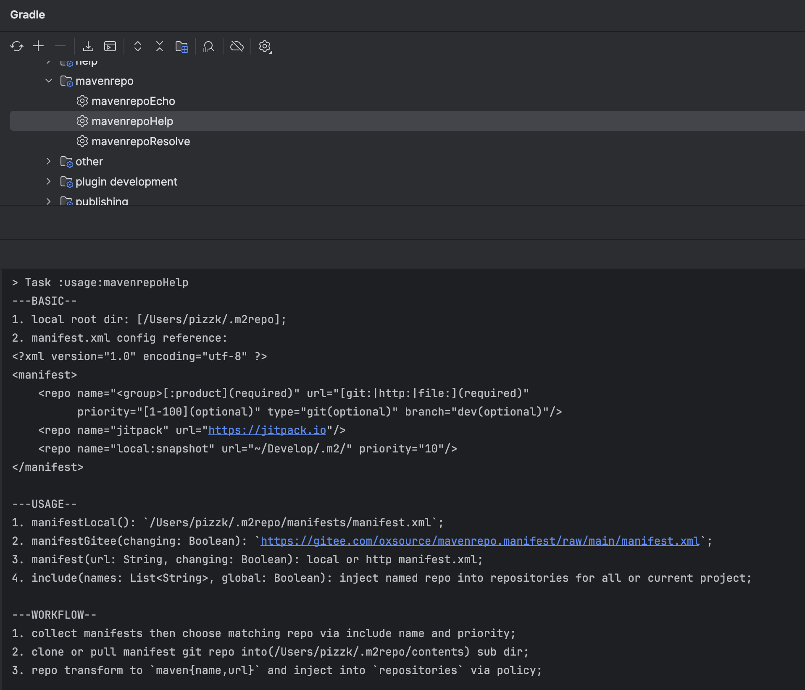

## WHAT

A simple gradle plugin:

1. Manage and switch maven repositories under multiple namespaces;
2. Very convenient for private git maven warehouse management.

## HOW
*support gradle version('gradle/wrapper/gradle-wrapper.properties'): gradle-7.6+*
<pre>
distributionBase=GRADLE_USER_HOME
distributionPath=wrapper/dists
distributionUrl=https\://services.gradle.org/distributions/gradle-7.6-bin.zip
zipStoreBase=GRADLE_USER_HOME
zipStorePath=wrapper/dists
</pre>

1. project 'build.gradle'

<pre>
buildscript {
    dependencies {
        classpath('io.github.oxsource:maven-repo-plugin:1.0.0')
    }
}
</pre>

2. module 'build.gradle'

<pre>
plugins {
    id 'pizzk.gradle.maven.repo'
}
...
mavenrepo {
    changing(false)
    manifests {
        manifestLocal()
        manifestGitee(false)
    }
    namespace {
        include(["local", "jitpack"])
    }
}
</pre>

3. run gradle task help

    

